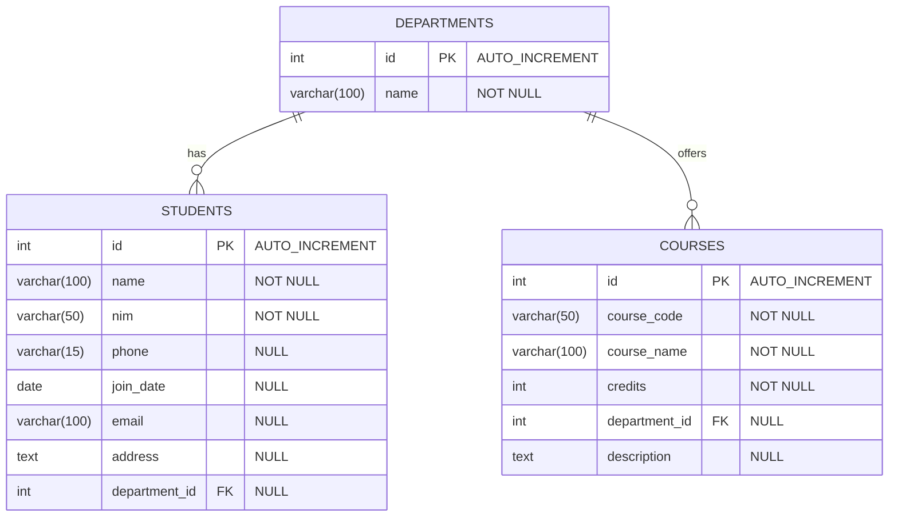

# Desain dan Pemrograman Berbasis Objek

---

## Tugas Praktikum 8

---

### Janji

---

Saya Fariz Wibisono dengan NIM 2307589 mengerjakan Tugas Praktikum 8 dalam mata kuliah Desain dan Pemrograman Berorientasi Objek untuk keberkahanNya maka saya tidak melakukan kecurangan seperti yang telah dispesifikasikan. Aamiin.

### Dokumentasi

---

Berikut adalah dokumentasi berupa rekaman hasil implementasi program:

<div align="center">
   <video src="https://github.com/user-attachments/assets/1ab38aca-4f06-47bb-ba04-71e24fde96c4" controls style="width: 100%;"></video>
</div>
### Diagram Kelas

---

Berikut adalah diagram Entity Relationship untuk sistem manajemen akademik:



Keterangan:
- Satu departemen dapat memiliki banyak mahasiswa (one-to-many)
- Satu departemen dapat menawarkan banyak mata kuliah (one-to-many)
- Setiap mahasiswa dan mata kuliah terhubung dengan satu departemen

### Penjelasan Alur Program

---

Program ini merupakan Sistem Manajemen Akademik berbasis web menggunakan PHP dengan paradigma Object-Oriented Programming (OOP) dan pola arsitektur MVC. Aplikasi ini dirancang untuk membantu pengelolaan data mahasiswa, departemen, dan mata kuliah. Berikut penjelasan detail alur program:

1. **Halaman Utama**:
   - Akses ke berbagai fitur manajemen melalui navigasi
   - Tampilan dan manajemen data siswa, departemen, dan mata kuliah

2. **Alur Manajemen Mahasiswa**:
   - Pengguna dapat melihat daftar semua mahasiswa dalam bentuk tabel
   - Form penambahan mahasiswa baru dengan validasi data
   - Data mahasiswa dapat diubah melalui form edit
   - Penghapusan data mahasiswa dengan konfirmasi

3. **Alur Manajemen Departemen**:
   - Pengguna dapat melihat daftar departemen
   - Form untuk menambahkan departemen baru
   - Pembaruan informasi departemen melalui form edit
   - Penghapusan data departemen dengan konfirmasi (dengan pengecekan referensi)

4. **Alur Manajemen Mata Kuliah**:
   - Pengguna dapat melihat daftar mata kuliah beserta detail kredit dan departemennya
   - Form penambahan mata kuliah baru dengan validasi data
   - Pembaruan informasi mata kuliah melalui form edit
   - Penghapusan data mata kuliah dengan konfirmasi

### Desain Sistem

---

Sistem ini dirancang dengan arsitektur MVC (Model-View-Controller) untuk memudahkan pemeliharaan dan pengembangan:

#### Model (models/)
- **Student.php**: Kelas untuk operasi CRUD data mahasiswa
  - Atribut: id, name, nim, phone, join_date, email, address, department_id
  - Metode: getAll(), getOne(), create(), update(), delete()

- **Department.php**: Kelas untuk operasi CRUD data departemen
  - Atribut: id, name
  - Metode: getAll(), getOne(), create(), update(), delete()

- **Course.php**: Kelas untuk operasi CRUD data mata kuliah
  - Atribut: id, course_code, course_name, credits, department_id, description
  - Metode: getAll(), getOne(), create(), update(), delete()

#### View (views/)
- **layouts/**: Template header dan footer untuk konsistensi UI
- **students/**: Halaman untuk manajemen data mahasiswa
- **departments/**: Halaman untuk manajemen data departemen
- **courses/**: Halaman untuk manajemen data mata kuliah

#### Controller (controllers/)
- **StudentController.php**: Controller untuk manajemen mahasiswa
- **DepartmentController.php**: Controller untuk manajemen departemen
- **CourseController.php**: Controller untuk manajemen mata kuliah

#### Konfigurasi dan Database
- **config/database.php**: Implementasi koneksi database dengan MySQLi
- **index.php**: Router utama aplikasi yang mengarahkan request ke controller yang sesuai

### Implementasi Konsep OOP

---

Sistem manajemen akademik ini menerapkan konsep-konsep OOP sebagai berikut:

1. **Encapsulation**: 
   - Atribut pada kelas model diatur dengan akses yang sesuai
   - Pengaksesan dan manipulasi data melalui metode khusus

2. **Inheritance**:
   - Struktur model yang mewarisi fungsionalitas koneksi database
   - Struktur view yang mewarisi template umum

3. **Polymorphism**:
   - Implementasi metode CRUD yang berbeda untuk setiap model
   - Metode yang disesuaikan dengan kebutuhan spesifik tiap entitas

4. **Abstraction**:
   - Interface yang konsisten untuk operasi CRUD di semua model
   - Detail implementasi teknis disembunyikan dari pengguna sistem

### Implementasi MySQLi dan Prepared Statements

---

Sistem ini menggunakan MySQLi dan prepared statements untuk semua interaksi dengan database untuk meningkatkan keamanan dan performa:

1. **Konfigurasi Database** (`config/database.php`):
   ```php
   $this->conn = new mysqli($this->host, $this->username, $this->password, $this->database);
   if ($this->conn->connect_error) {
       throw new Exception("Connection failed: " . $this->conn->connect_error);
   }
   ```

2. **Implementasi Prepared Statements di Model**:
   - Contoh Create Operation:
     ```php
     $query = "INSERT INTO students (name, nim, phone, join_date, email, address, department_id) VALUES (?, ?, ?, ?, ?, ?, ?)";
     $stmt = $this->conn->prepare($query);
     $stmt->bind_param("ssssssi", $this->name, $this->nim, $this->phone, $this->join_date, $this->email, $this->address, $this->department_id);
     $stmt->execute();
     ```

3. **Keamanan Input**:
   - Semua input pengguna disanitasi sebelum diproses:
     ```php
     $this->name = htmlspecialchars(strip_tags($this->name));
     ```
   - Semua input pengguna di-bind ke prepared statements untuk mencegah SQL injection
   - Validasi data sebelum penyimpanan ke database

### Instalasi dan Penggunaan

---

1. **Prasyarat**:
   - XAMPP (versi 7.4 atau lebih baru)
   - Browser web modern

2. **Langkah Instalasi**:
   - Salin seluruh folder proyek ke direktori `htdocs` XAMPP
   - Buat database `tp8dpboc12025` di phpMyAdmin
   - Import file `schema.sql` ke database
   - Pastikan konfigurasi database di `config/database.php` sesuai dengan pengaturan lokal Anda
   - Akses aplikasi di `http://localhost/TP8DPBOC12025/tp_mvc`

3. **Fitur Utama**:
   - Manajemen data mahasiswa (tambah, lihat, edit, hapus)
   - Manajemen data departemen (tambah, lihat, edit, hapus)
   - Manajemen data mata kuliah (tambah, lihat, edit, hapus)
   - Validasi data dan keamanan input